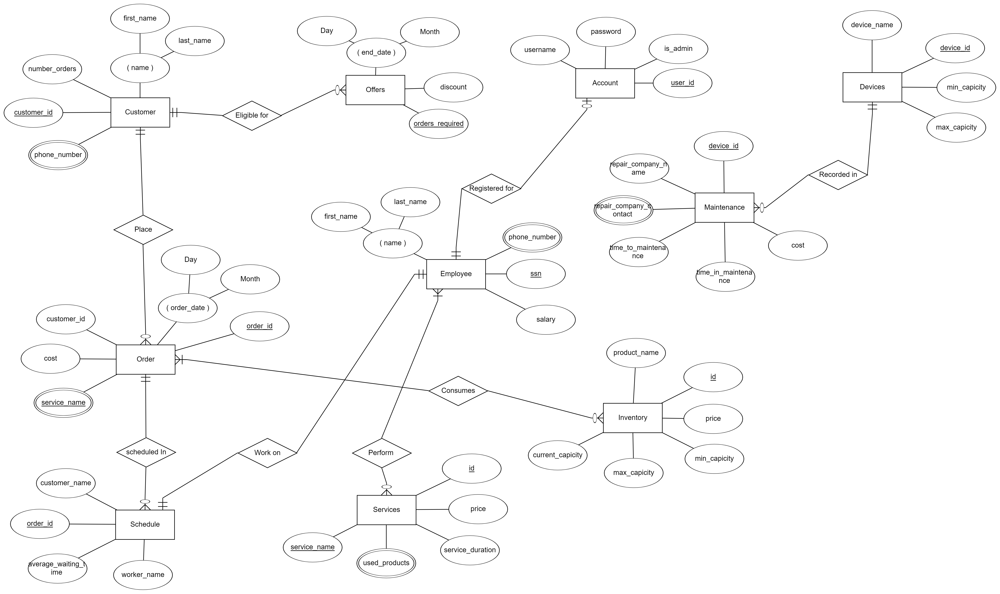

# DB-F22-Team-18
This is Database course project Fall 2022, we are working in a team of 4 computer engineering students. we will be using an SQL server language along with C# to implement a desktop application

As the world is moving towards digitalization. We looked at a system that could be digitalized, and we choose a management system for a beauty salon.  

We’re planning to implement a Desktop Application to be used as a management system for a small beauty salon. We are going to resample a real beauty salon system where simply we have customers, Teller, and  administrator. The teller and admin will use the application to facilitate their work to store data of the salon orders, inventory, employees, and customers through a well designed simple UI. 

In this system there will be two users, first the Admin who represent the salon owner. Teller who represent the one working on the front desk to place orders and answer the customers questions and offer them discounts. A list of the users privileges could be found in the next section.

At the time we're working on UI we've also reached our first version of ERD (inserted below) 

